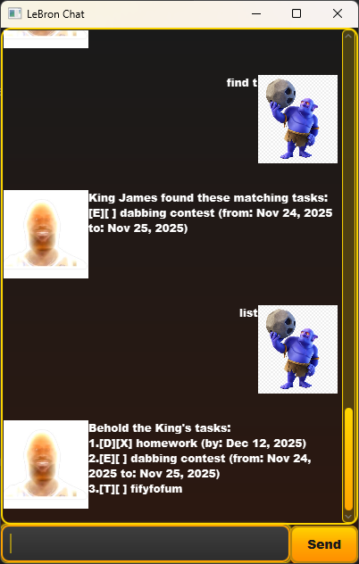

# LebronChat User Guide



Welcome to LebronChat - The King's personal task management assistant! 👑

LebronChat is a basketball-themed chatbot inspired by LeBron James that helps you manage your daily tasks with the confidence and determination of a champion. Whether you're organizing your game plan, tracking deadlines, or planning events, the King has got your back!

## Adding todos

Create simple tasks without any specific deadlines. Perfect for general reminders and daily activities.

Example: `todo Practice free throws`

LebronChat will add the todo task to your list and confirm the addition with the King's signature style.

```
King James has added a new task:
[T][ ] Practice free throws
Now you have 1 tasks in the list
```

## Adding deadlines

Set tasks with specific due dates to keep you on track. The King knows that champions never miss their deadlines!

Example: `deadline Submit championship report /by 2024-12-31`

LebronChat will create a deadline task with the specified date and remind you that greatness requires meeting deadlines.

```
King James is setting a deadline!
[D][ ] Submit championship report (by: Dec 31, 2024)
Nothing easy! Deadline set!
```

## Adding events

Schedule events that span across multiple days or have specific start and end dates. Perfect for tournaments, training camps, or important meetings.

Example: `event NBA Finals /from 2024-06-06 /to 2024-06-18`

LebronChat will create an event with your specified date range and celebrate the addition.

```
King James is adding an event!
[E][ ] NBA Finals (from: Jun 6, 2024 to: Jun 18, 2024)
Witness! Event added!
```

## Viewing your task list

Display all your current tasks in one organized view. See everything on your plate just like reviewing game film.

Example: `list`

LebronChat will show all your tasks with their completion status and relevant dates.

```
Behold the King's tasks:
1.[T][ ] Practice free throws
2.[D][ ] Submit championship report (by: Dec 31, 2024)
3.[E][ ] NBA Finals (from: Jun 6, 2024 to: Jun 18, 2024)
```

## Marking tasks as complete

Celebrate your victories by marking completed tasks. Nothing feels better than crossing items off your championship checklist!

Example: `mark 1`

LebronChat will mark the specified task as completed and crown your achievement.

```
Crown this task! Marked as done:
[T][X] Practice free throws
```

## Unmarking completed tasks

Sometimes you need to put a task back in play. No worries - even champions need to revisit their strategies.

Example: `unmark 1`

LebronChat will unmark the task and put it back in your active list.

```
This task is back in the game! Unmarked:
[T][ ] Practice free throws
```

## Deleting tasks

Remove tasks that are no longer relevant or needed. Keep your list clean and focused like a championship roster.

Example: `delete 2`

LebronChat will remove the specified task and update your task count.

```
King James has removed this task:
[D][ ] Submit championship report (by: Dec 31, 2024)
Now you have 2 tasks left!
```

## Finding tasks

Search through your tasks using keywords. Perfect for when you have many tasks and need to find specific ones quickly.

Example: `find basketball`

LebronChat will display all tasks that contain your search keyword.

```
King James found these matching tasks:
[T][ ] Practice basketball drills
[E][ ] Basketball tournament (from: Jun 1, 2024 to: Jun 3, 2024)
```

## Checking due tasks

View tasks that are due by a specific date or see what's due today. Stay ahead of the game and never miss important deadlines.

Example: `due 2024-12-31` or `due` (for today's tasks)

LebronChat will show tasks due by your specified date, sorted chronologically.

```
Tasks due by 2024-12-31 (King's schedule):
[D][ ] Submit championship report (by: Dec 31, 2024)
[E][ ] Year-end celebration (from: Dec 30, 2024 to: Dec 31, 2024)
```

## Getting help

Access the complete command reference and usage instructions whenever you need guidance.

Example: `help`

LebronChat will provide detailed information about all available commands and their formats.

```
King James says:
Available Commands:
- todo <description>: Add a simple task
- deadline <description> /by YYYY-MM-DD: Add task with deadline
- event <description> /from YYYY-MM-DD /to YYYY-MM-DD: Add event
- list: View all tasks
- mark <number>: Mark task as completed
- unmark <number>: Unmark completed task
- delete <number>: Remove task
- find <keyword>: Search tasks
- due [YYYY-MM-DD]: Show due tasks
- help: Show this help message
```

## Command Summary

| Command | Format | Purpose |
|---------|--------|---------|
| `todo` | `todo <description>` | Add simple task |
| `deadline` | `deadline <description> /by YYYY-MM-DD` | Add task with deadline |
| `event` | `event <description> /from YYYY-MM-DD /to YYYY-MM-DD` | Add event with date range |
| `list` | `list` | Show all tasks |
| `mark` | `mark <task_number>` | Mark task as complete |
| `unmark` | `unmark <task_number>` | Unmark task |
| `delete` | `delete <task_number>` | Remove task |
| `find` | `find <keyword>` | Search tasks |
| `due` | `due [YYYY-MM-DD]` | Show due tasks |
| `help` | `help` | Show command reference |

---

**"Strive for greatness."** - LeBron James 👑🏀